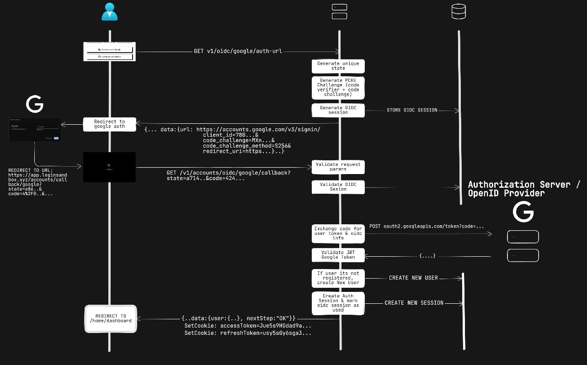
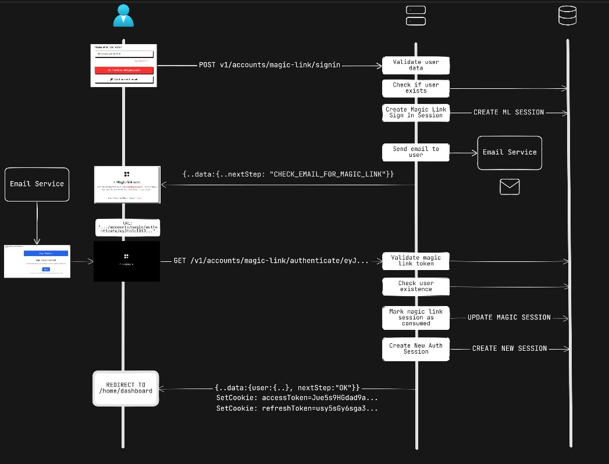
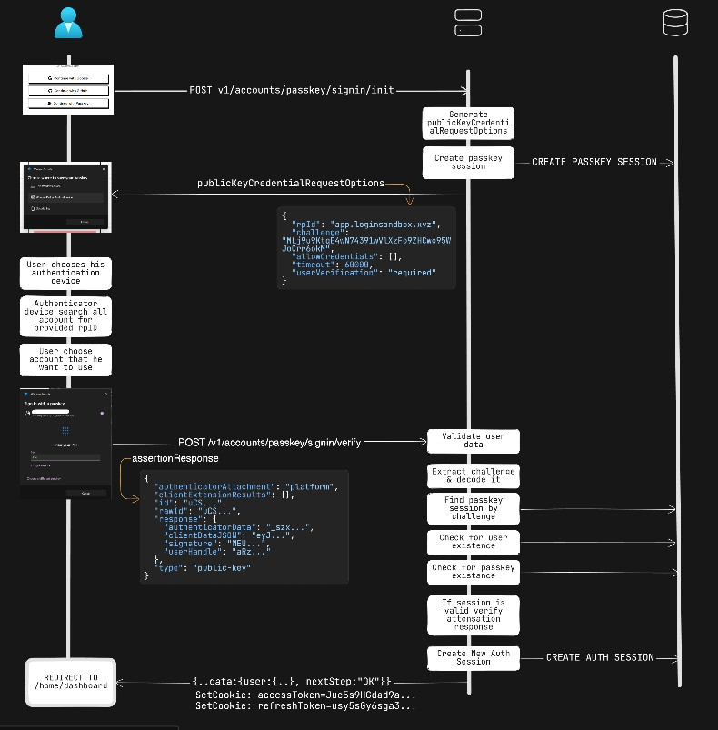
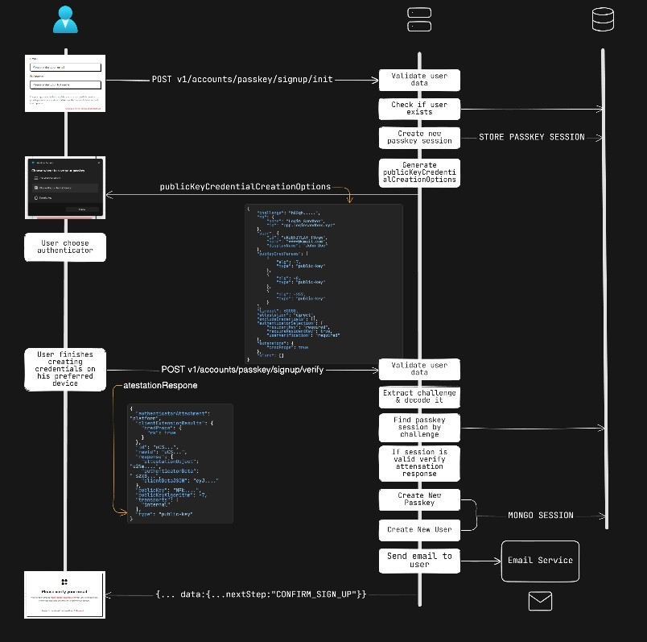

> ⚡ **TL;DR** [Take me straight to the Flow Diagrams](#flow-diagrams)

## Introduction

**Login Sandbox** is a comprehensive authentication platform designed to demonstrate modern, production-grade identity and access management practices. The project showcases a fully-featured, security-focused implementation that adheres to current industry standards, covering both traditional and passwordless authentication workflows.

### Project Resources

- **Live Project:** https://app.loginsandbox.xyz/
- **API Documentation:** https://docs.loginsandbox.xyz/
- **LinkedIn Profile:** https://www.linkedin.com/in/amscu/

## Features

At its core, Login Sandbox provides username-password authentication system extended with **Multi-Factor Authentication (MFA)** using **TOTP (Time-based One-Time Passwords)** to enhance account security. Beyond classical flows, the platform integrates **OpenID Connect (OIDC)** for seamless third-party authentication, currently supporting **Google** and **GitHub** as identity providers.

To highlight secure and frictionless authentication models, the project also implements **Magic Link (passwordless)** login and a fully compliant **WebAuthn / Passkey** system. This includes both **usernameless (discoverable) credentials** and **non-discoverable credentials**, enabling sign-up and sign-in without a password while ensuring strong hardware-backed cryptographic authentication.

Once authenticated, users gain access to account and session management features, such as viewing active sessions, revoking device access, and registering new passkeys. All protected resources are secured using a **token-based authorization architecture** built around **short-lived Access Tokens** and **Refresh Tokens** for persistent sessions .

All API endpoints are rigorously documented using the **OpenAPI specification**, ensuring full transparency, type safety, and predictable integration behavior. Every authentication flow is implemented strictly in accordance with the relevant **IETF RFC standards** governing OAuth 2.0, OIDC, WebAuthn, token lifecycles, and cryptographic ceremonies.

## Tech Stack

-  **Full-Stack TypeScript** – shared types across backend & frontend for strict end-to-end type-safety.
-  **Node.js + Express** – backend API, authentication flows, secure session management.
-  **MongoDB (Mongoose)** – primary database with schema validation & strong typing.
-  **OpenAPI Specification** – full API documentation and schema-driven backend contracts.
-  **Orval** – automatic generation of a **fully typed API client**, synchronized with the backend.
-  **SimpleWebAuthn** – WebAuthn/Passkey support for usernameless & passwordless auth.
-  **Passport.js** – modular authentication middleware for JWT strategies.
-  **Winston** – structured logging with rotating file support.
-  **Next.js 14** – frontend application with server components, routing & optimized rendering.
-  **TailwindCSS** – utility-first styling, fast UI development, consistent design.
-  **shadcn/ui** – reusable, accessible UI components built on Radix primitives.

## Flow Diagrams

### Password Authentication

#### Sign Up Flow

- **Input Validation & Schema Enforcement**
  - Uses **Zod** to validate user input.
  - Protects against invalid or injectable data.
- **Password Hashing & Protection**

  - Passwords are hashed using **bcrypt** combined with HMAC `pepper` (`hmacWithPepper`).
  - The `pre("save")` middleware ensures passwords are always hashed before storage.
  - Provides protection against **rainbow table attacks**.
  - ([OWASP Password Storage Cheat Sheet](https://cheatsheetseries.owasp.org/cheatsheets/Password_Storage_Cheat_Sheet.html))

- **Email Verification / Account Confirmation**

  - Generates unique codes with `randomUUID()`, ensuring high entropy and unpredictability.
  - Codes expire after 45 minutes (`expiresAt`) to limit brute-force attacks.
  - MongoDB TTL indexes (`expireAfterSeconds`) automatically clean up expired codes.

- **Atomic Transactions**
  - Uses `mongoose.startSession()` and `withTransaction()` to guarantee atomic operations between `User` and `VerificationCode`.
  - Prevents inconsistent states if database operations fail or the email fails to send.

  

#### Sign In with 2FA Flow

- **Input Validation & Schema Enforcement**
  - Uses **Zod** to validate the login request payload.
  - Prevents malformed or malicious data from entering the authentication flow.
- **Email Verification Check**

  - Ensures that users complete email verification before proceeding with login.
  - Prevents unauthorized access by unverified accounts.

- **Password Verification & Protection**

  - Passwords are verified against bcrypt + HMAC `pepper` hashes.
  - Provides protection against brute-force and rainbow table attacks.
  - ([OWASP Password Storage Cheat Sheet](https://cheatsheetseries.owasp.org/cheatsheets/Password_Storage_Cheat_Sheet.html))

- **Multi-Factor Authentication (MFA)**

  - MFA is implemented using **TOTP** (Time-based One-Time Passwords) via `speakeasy`.
  - Generates a temporary MFA token (JWT) with short expiration (`5m`) to complete login securely.
  - MFA sessions are tracked in the database and marked as consumed upon successful verification.
  - Decryption of stored 2FA secrets is performed per-user using AES-256-GCM with AAD to bind it to the user.

- **JWT-based Session Management**

  - Issues **access** and **refresh tokens** upon successful login or MFA completion.
  - Tokens are signed using RS256 for asymmetric signing, and include session IDs to prevent token replay.
  - Tokens have strict expiration times (`access: 15m`, `refresh: 30d`) and are scoped by audience/issuer.
  - Refresh and MFA tokens are handled separately to avoid elevating session privileges before MFA completion.
  - Follows **RFC 7519 – JSON Web Token (JWT)** specification: [https://www.rfc-editor.org/rfc/rfc7519](https://www.rfc-editor.org/rfc/rfc7519)

- **Atomic & Secure Operations**

  - MFA sessions, user sessions, and token issuance are transactional and consistent.
  - Tokens and MFA cookies are sent using secure cookie options (`HttpOnly`, `Secure`, `SameSite=Strict`) to prevent XSS and CSRF attacks.

- **Error Handling & Security**

  - Limits MFA attempts by verifying TOTP with a `window` of 1 step to prevent replay attacks.

- **Encryption & Secret Management**
  - 2FA secrets are encrypted per user using AES-256-GCM with user-bound AAD.

  

#### Forgot password with 2FA Flow

- User submits email → input validated via schema.
- System checks existence of user and enforces rate limiting (max 2 requests per 3 minutes).
- If MFA is enabled, an MFA session is generated with a signed `mfaToken` (short-lived JWT) and set in a secure cookie.
- User must verify MFA code via authenticator app; code is validated with decrypted TOTP secret.
- Upon successful MFA verification, a password reset verification code is created and emailed with a time-limited link.
- MFA session is marked as consumed to prevent replay attacks; email sending is retried with safe fallback on failure.
- All password reset attempts, including failed attempts, are logged in the database, and a confirmation email is sent to the user upon successful password change.

  

### OIDC Authentication

#### General Flow - Google Provider

- **State Parameter for CSRF Protection**

  - Each OIDC authorization request includes a random `state` value stored in the backend.
  - Ensures that the authorization response corresponds to the initiated request, mitigating CSRF attacks.

- **PKCE (Proof Key for Code Exchange)**

  - Generates a `codeVerifier` and `codeChallenge` per session.
  - Protects against authorization code interception attacks, especially on public clients or single-page applications.

- **Short-Lived OIDC Sessions**

  - Sessions expire in 5 minutes and are marked as consumed after use.
  - Prevents replay attacks and enforces single-use authorization codes.

- **JWT Token Security**

  - Application access and refresh tokens are signed with RS256.
  - Tokens include session IDs and strict expiration (`access: 15m`, `refresh: 30d`) to prevent token replay and misuse.

- **Backend Token Validation**

  - ID tokens from Google are verified using JWKS to ensure authenticity and integrity.
  - Validates `audience`, `issuer`, and token signature to prevent impersonation or tampering.

- **Minimal Privilege & Data Scope**

  - Only `openid profile email` scopes are requested.
  - Reduces risk if tokens are intercepted or misused.

- **References:**
  - [RFC 6749 - OAuth 2.0 Authorization Framework](https://www.rfc-editor.org/rfc/rfc6749)
  - [RFC 7636 - PKCE: Proof Key for Code Exchange](https://www.rfc-editor.org/rfc/rfc7636)
  - [OpenID Connect Core 1.0](https://openid.net/specs/openid-connect-core-1_0.html)

  

### Magic-Link Authentication

#### Sign In Flow

- **Unique session token**

  - Each magic link uses a JWT with a unique `jti` tied to a DB session (`MagicLinkModel`).
  - Prevents replay attacks and reuse of links.

- **Email-based authentication**

  - Magic links are sent only to verified email addresses.
  - Attackers cannot log in without access to the user's email.

- **Signed JWT**

  - Magic link tokens are signed with HS256 and have expiration (`magicLinkTokenOptions`).
  - Ensures token integrity and authenticity.

- **Replay protection**

  - Each token is tied to a `magicLinkSessionId`.
  - After usage, the session can be marked as consumed.

  

### Passkey Authentication

#### Sign In Flow (usernameless)

This flow implements **username‑less authentication** using **WebAuthn Level 2** (Passkeys).

- **Resources**

  - [W3C WebAuthn Level 2 Specification](https://www.w3.org/TR/webauthn-2/)

- **Challenge–Response Authentication (WebAuthn Standard)**

  - The server generates a **fresh, random challenge** (`generateAuthenticationOptions`).
  - Challenge is stored in DB (`PasskeyChallengeSessionModel`) with:
    - purpose (`signin`)
    - expiration timestamp
    - consumed flag
  - This prevents replay attacks, cloned challenge attacks, and stale authentication.

- **Username‑less Sign‑in**

  - User does **not** provide email or username.
  - User identity is derived from the **passkey itself**, using:
    - `authenticationResponse.response.userHandle`
  - This prevents:
    - user enumeration
    - credential stuffing
    - account discovery attacks

- **Strict Challenge Validation**

  - During verification the server enforces:
    - challenge existence in DB
    - matching purpose (`signin`)
    - session not consumed
    - session not expired
    - challenge in the response = challenge in DB

- **Device‑bound Cryptographic Key Verification**
  - Each passkey has:
    - unique credential ID
    - public key (base64 stored)
    - signature counter

  

#### Sign Up Flow

- **Challenge-based registration**

  - Each sign-up session generates a unique `challenge` stored in the DB (`PasskeyChallengeSessionModel`).
  - Prevents replay attacks and ensures the response is tied to a specific registration attempt.

- **Session expiration**

  - Each challenge has a TTL; expired sessions cannot be reused.
  - Protects against delayed or intercepted registration attempts.

- **Single-use challenges**

  - Challenges are marked as `consumed` after registration.
  - Prevents multiple registrations using the same challenge (replay attack).

- **User enumeration prevention**

  - Registration requests do not reveal whether an email already exists.
  - Reduces risk of attackers probing for existing accounts.

- **WebAuthn verification**

  - Registration response is verified with `expectedChallenge`, `expectedOrigin`, and `expectedRPID`.
  - Ensures the authenticator is legitimate and bound to the correct relying party.

- **Atomic database operations**

  - MongoDB transaction is used to create user, passkey, challenge session, and verification code.
  - Ensures consistency and prevents partial user creation.

- **Secure credential storage**
  - PublicKeyCredential and metadata stored in DB (`PasskeyModel`) for future authentication.
  - Counter tracking prevents replay of authentication responses.

  

## License & Support

### License

This project is licensed under the **Apache License 2.0**.

- **Full license text:** [Apache License, Version 2.0, January 2004](http://www.apache.org/licenses/)
- You are free to **use, reproduce, and distribute** this project according to the terms of the license.

### Support & Feedback

If you encounter any bugs, have suggestions, or need help, you can reach out in the following ways:

- **Open an issue on GitHub:**  
  

- **Connact me on LinkedIn:**  
  
