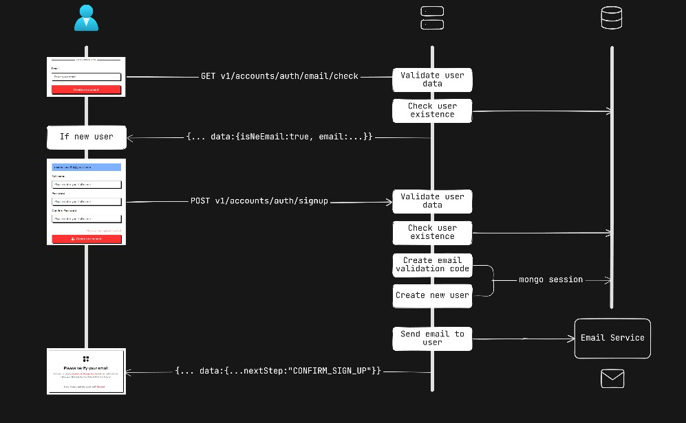
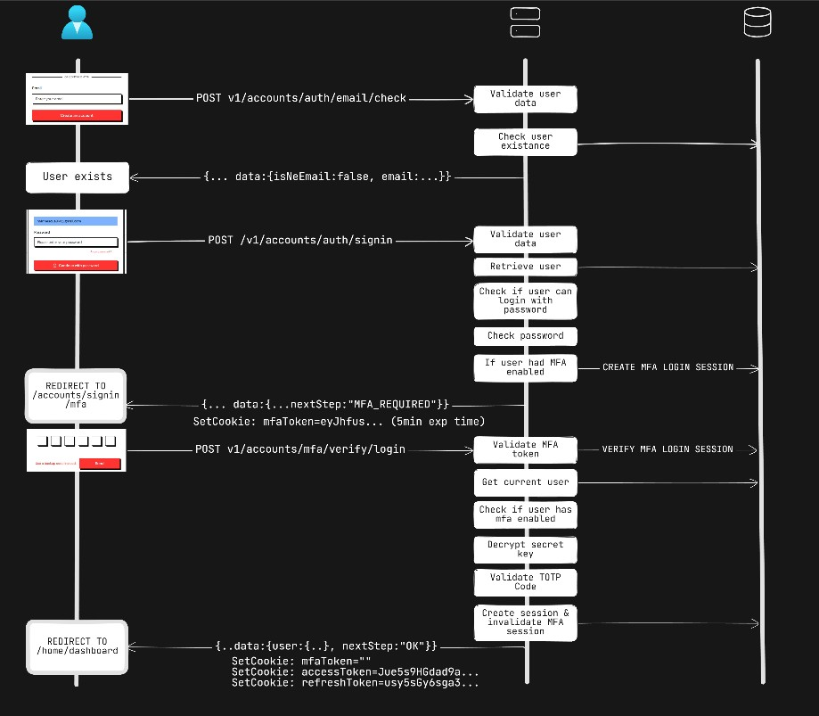
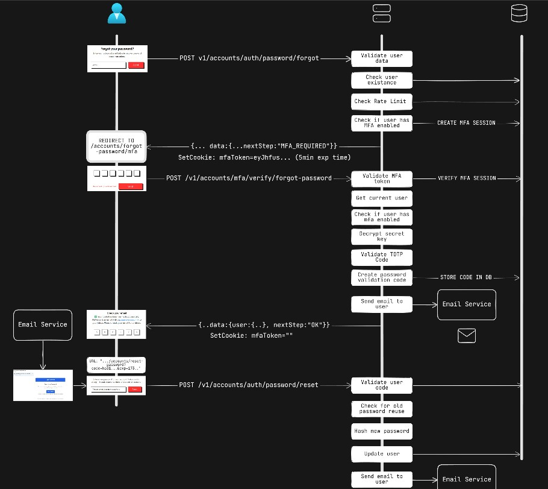

> ⚡ **TL;DR** [Take me straight to the Flow Diagrams](#flow-diagrams)

## Introduction

**Login Sandbox** is a comprehensive authentication platform designed to demonstrate modern, production-grade identity and access management practices. The project showcases a fully-featured, security-focused implementation that adheres to current industry standards, covering both traditional and passwordless authentication workflows.

### Project Resources

- **Live Project:** https://app.loginsandbox.xyz/
- **API Documentation:** https://docs.loginsandbox.xyz/
- **LinkedIn Profile:** https://www.linkedin.com/in/amscu/

## Features

At its core, Login Sandbox provides username-password authentication system extended with **Multi-Factor Authentication (MFA)** using **TOTP (Time-based One-Time Passwords)** to enhance account security. Beyond classical flows, the platform integrates **OpenID Connect (OIDC)** for seamless third-party authentication, currently supporting **Google** and **GitHub** as identity providers.

To highlight secure and frictionless authentication models, the project also implements **Magic Link (passwordless)** login and a fully compliant **WebAuthn / Passkey** system. This includes both **usernameless (discoverable) credentials** and **non-discoverable credentials**, enabling sign-up and sign-in without a password while ensuring strong hardware-backed cryptographic authentication.

Once authenticated, users gain access to account and session management features, such as viewing active sessions, revoking device access, and registering new passkeys. All protected resources are secured using a **token-based authorization architecture** built around **short-lived Access Tokens** and **Refresh Tokens** for persistent sessions .

All API endpoints are rigorously documented using the **OpenAPI specification**, ensuring full transparency, type safety, and predictable integration behavior. Every authentication flow is implemented strictly in accordance with the relevant **IETF RFC standards** governing OAuth 2.0, OIDC, WebAuthn, token lifecycles, and cryptographic ceremonies.

## Tech Stack

-  **Full-Stack TypeScript** – shared types across backend & frontend for strict end-to-end type-safety.
-  **Node.js + Express** – backend API, authentication flows, secure session management.
-  **MongoDB (Mongoose)** – primary database with schema validation & strong typing.
-  **OpenAPI Specification** – full API documentation and schema-driven backend contracts.
-  **Orval** – automatic generation of a **fully typed API client**, synchronized with the backend.
-  **SimpleWebAuthn** – WebAuthn/Passkey support for usernameless & passwordless auth.
-  **Passport.js** – modular authentication middleware for JWT strategies.
-  **Winston** – structured logging with rotating file support.
-  **Next.js 14** – frontend application with server components, routing & optimized rendering.
-  **TailwindCSS** – utility-first styling, fast UI development, consistent design.
-  **shadcn/ui** – reusable, accessible UI components built on Radix primitives.

## Flow Diagrams

### Password Authentication

- Sign Up Flow

  

- Sign In with 2FA Flow

  

- Forgot password with 2FA Flow

  

